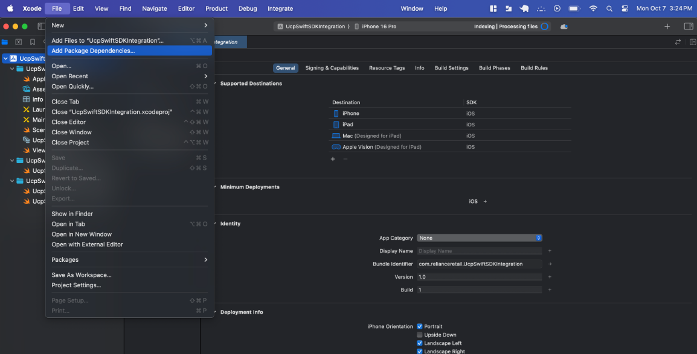
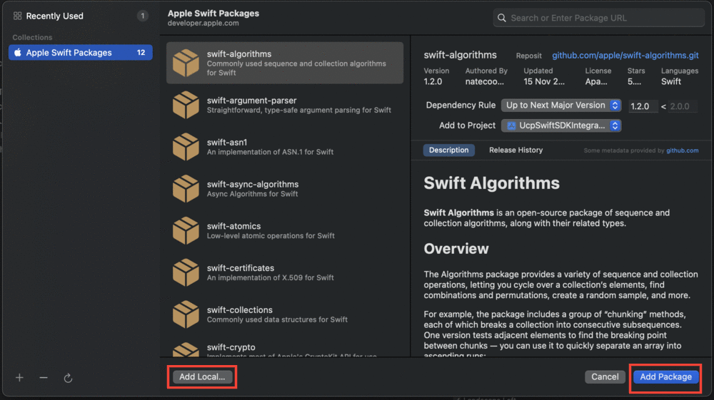
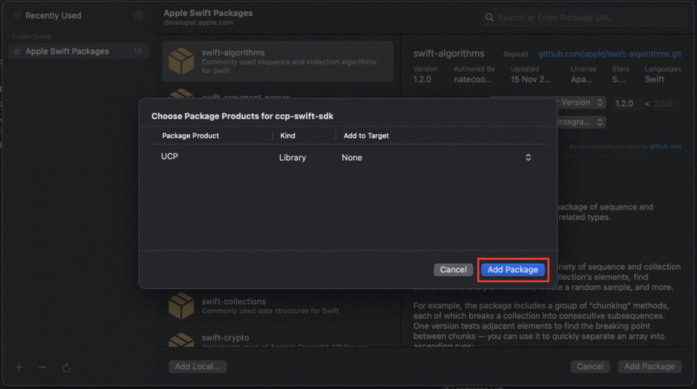
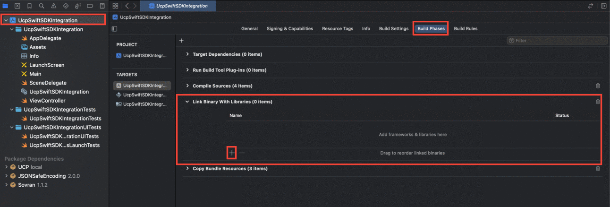
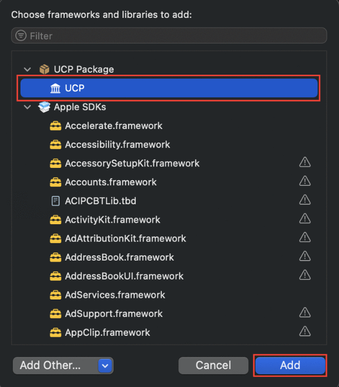

# iOS SDK Documentation

## Overview

The UCP Clickstream iOS SDK enables you to track user interactions and events in your iOS applications. This guide provides comprehensive documentation for implementing and configuring the iOS SDK.

## Installation & Setup

### 1. Download the SDK
- [Download ccp-swift-sdk.zip](https://cdn.pixelbin.io/v2/autumn-band-3b0a0b/original/ucp-sdk/ios/ccp-swift-sdk.zip)
- Unzip the downloaded file.

### 2. Import UCP SDK to Your Codebase
- In Xcode, go to **File > Swift Packages > Add Package Dependency**.
- Select **Add Local** in the bottom left, and navigate to the folder containing the `ucp-swift-sdk` package.



### 3. Build Settings
- Ensure that the UCP package is properly linked to the target.
- Go to **Build Phases > Link Binary with Libraries** and check if UCP is listed. If not, add it manually by clicking the "+" button and searching for UCP. Once it appears, click on "Add".



### 4. Clean and Rebuild
- After verifying the above steps, perform a **Clean Build Folder** (under Product > Clean Build Folder or press `Command + Shift + K`) and rebuild your project.



## SDK Initialization

To use the SDK's functionalities, you must initialize it with appropriate configurations. Go to your `AppDelegate` file and add the following snippet:

```swift
import UIKit
import UCP
@main
class AppDelegate: UIResponder, UIApplicationDelegate {
    var analytics: Analytics? = nil
    func application(_ application: UIApplication, didFinishLaunchingWithOptions launchOptions: [UIApplication.LaunchOptionsKey: Any]?) -> Bool {
        // Override point for customization after application launch.
        let configuration = Configuration(writeKey: "YOUR_WRITE_KEY")
            .apiHost("YOUR_API_HOST")
            .cdnHost("YOUR_CDN_HOST")
            .trackApplicationLifecycleEvents(true)
            .flushInterval(10)
            .flushAt(2)
        analytics = Analytics(configuration: configuration)
        return true
    }
}
```

> **Reach out to the UCP Team for your unique `apiHost`, `cdnHost`, and `writeKey` values.**



## Tracking Events

> ⚠️ **Ensure that you do not call these tracking methods on the main or UI thread to avoid UI blocking.**

The SDK allows you to track events throughout your application. Example for tracking a "Product Viewed" event:

```swift
import UIKit
import UCP
class ViewController: UIViewController {
    var analytics: Analytics? {
        return UIApplication.shared.delegate?.analytics
    }
    var usage: TimeInterval = 0
    var timer: Timer? = nil
    @IBOutlet weak var eventView: UITextView!
    override func viewDidLoad() {
        super.viewDidLoad()
        timer = Timer.scheduledTimer(withTimeInterval: 1, repeats: true) { _ in
            self.usage += 1
        }
        let outputCapture = OutputPlugin(textView: eventView)
        analytics?.add(plugin: outputCapture)
    }
    @IBAction func trackTapped(_ sender: Any) {
        let payload: [String: Any] = [
            "external_ids": [
                ["type": "rr_id", "id": "bc458c00-7054-43da-85c8-f756afd2a9e2"]
            ],
            "application_ids": [
                ["type": "jiomart_id", "id": "2325"]
            ],
            "click_source": "Fashion Products",
            "product_id": "590009356",
            "product_name": "Cotton Henley T-shirt",
            "l1_category": "Fashion",
            "l2_category": "Boys",
            "l3_category": "Western Wear",
            "l4_category": "Tshirts",
            "l5_category": "",
            "brand": "KB TEAM SPIRIT",
            "quantity": 1,
            "price": 205,
            "value": 205,
            "currency": "INR",
            "url": "https://jiomart-sit.jio.com/p/fashion/cotton-henley-t-shirt/590009356",
            "img_url": "https://jiomart-sit.jio.com/images/product/original/440745742_1.jpg",
            "meta": [:],
            "l1_category_id": "3",
            "l2_category_id": "499",
            "l3_category_id": "500",
            "l4_category_id": "507",
            "l5_category_id": "",
            "sku": "440745742008",
            "position": 1,
            "brand_id": "1361"
        ]
        analytics?.track(name: "Product Viewed", properties: payload)
    }
}
```



## Best Practices
- Always initialize the SDK before tracking events.
- Never call tracking methods on the main/UI thread.
- Validate event payloads before sending.
- Use unique identifiers for users and applications.

## Troubleshooting
- Ensure the SDK is properly linked in your Xcode project.
- Check for correct API host, CDN host, and write key values.
- Contact UCP support for integration issues. 